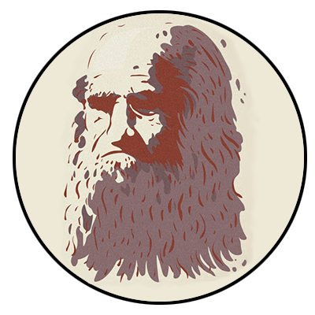

<link rel="stylesheet" href="styles.css">
</style>
<h1 align = 'center'>LEO API</h1>

 Данный бот создан для автоматизации работы с вк сообществом <b id = 'name'>"Леонардо Дайвинчик"</b>

Правила работы с ботом: 
    <ul>
        <li>Открыть файл <mark id = 'file'>settings.py</mark></li>
        <li>Следуя инструкциям в файле заполнить необходимые переменные</li>
        <li>Перейти в файл <mark id = 'file'>main.py</mark> и запустить его</li>
        <li>Работайте с терминалом</li>
        </ul>

Вывод лайкнувших вас людей осуществляется в "Избранное" в Вконтакте и в файлик <mark id = 'file'>like.txt</mark>

